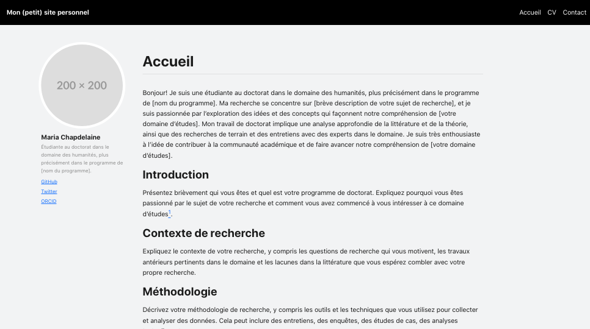

# Créer son (petit) site personnel avec Pandoc



Une recette pour fabriquer une page web (ou deux…) bien à soi, grâce à Pandoc!

Taille idéale du site : entre 1 et 5 pages.

(Note : cette recette n’est pas adaptée pour les sites avec des sections.)

## Prérequis

Connaissances de base :

- Markdown ([séance sur le balisage](https://debugue.ecrituresnumeriques.ca/seance-01-langages-de-balisage/))
- HTML ([séance sur HTML](https://debugue.ecrituresnumeriques.ca/seance-01-langages-de-balisage/))
- CSS ([séance sur CSS](https://debugue.ecrituresnumeriques.ca/seance-02-introduction-css/))

Boîte à outils :

- un terminal (interface en ligne de commande)
- un éditeur de texte
- [pandoc](https://pandoc.org/installing.html)
- [make](https://www.gnu.org/software/make/) (optionnel, voir [ce billet](https://programminghistorian.org/en/lessons/building-static-sites-with-jekyll-github-pages) pour l’installation des outils en ligne de commande)

## Tutoriel
Suivez d’abord l’exercice dans le dossier [`tutoriel/`](tutoriel), puis frottez-vous à un petit site personnel!

## Commandes

Pour commencer se déplacer dans le répertoire `site` :

```shell
cd site
```

Utiliser `make` pour lancer des commandes (si `make` est installé) :

```shell
# fabriquer les fichiers HTML
make all

# nettoyer les fichiers HTML construits
make clean

# commande par défaut, qui fait clean + all
make
```

Si vous n’avez pas make, le petit script shell fera l’affaire :

```shell
./site.sh # ou encore: `bash site.sh`
```

## Pour aller plus loin

Il existe une myriade de générateurs de sites statiques : [Yst](https://github.com/jgm/yst), [Jekyll](https://jekyllrb.com/), [Hakyll](https://jaspervdj.be/hakyll/), [Hugo](https://gohugo.io/). On peut aussi apprendre d’initiatives personnelles, comme celle de l’historien Caleb McDaniel et son [script bash](https://github.com/wcaleb/website). La bonne nouvelle, c’est que les contenus rédigés en markdown peuvent être trivialement transférés d’un système à l’autre. Chaque système vient avec ses forces, ses faiblesses, ses solutions et sa complexité. À vous, lecteur·trice curieux·euse, [de poursuivre votre exploration](https://jamstack.org/generators/)…

## Licence

Ce travail est placé dans le domaine public universel selon les modalités décrites par la Creative Commons Zero (CC0). Vous pouvez réutiliser librement les ressources et les repartager selon vos propres conditions.
